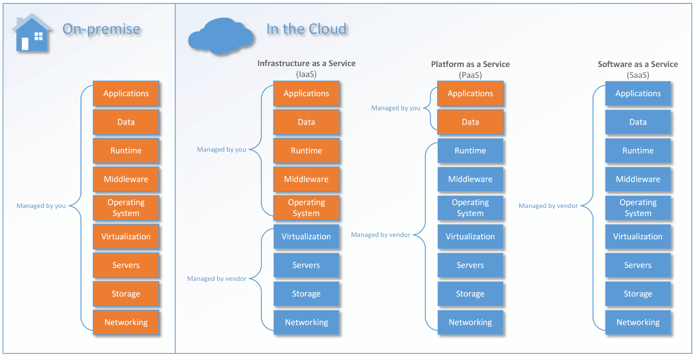

*The Microsoft Azure Marketplace is an online store that offers
applications and services either built on or designed to integrate
with Microsoft's Azure public cloud.*

## IaaS - Infrastructure as a service

"Infrastructure as a service" (IaaS) refers to online services that provide high-level APIs used to dereference various
low-level details of underlying network infrastructure like physical computing resources, location, data partitioning, scaling, security, backup etc

> Example resources are Windows 2016 Datacenter server, Load Balancer, Firewall, etc

## PaaS - Platform as a service

In the PaaS models, cloud providers deliver a computing platform, typically including operating system, programming-language
execution environment, database, and web server. Application developers can develop and run their software solutions on a cloud
platform without the cost and complexity of buying and managing the underlying hardware and software layers.

> Example resources are Web app, SQL Database, API app, etc

## SaaS - Software as a service

In the software as a service (SaaS) model, users gain access to application software and databases. Azure will manage the infrastructure
and platforms that run the applications. SaaS is sometimes referred to as "on-demand software" and is usually priced on a pay-per-use basis
or using a subscription fee.

In the SaaS model, Azure will install and operate application software in the cloud and cloud users access the software from cloud clients.
Cloud users do not manage the cloud infrastructure and platform where the application runs. This eliminates the need to install and run the
application on the cloud user's own computers, which simplifies maintenance and support.

> Example resources are Enterprise Password Vault, App Dynamics, Barracuda WAF-as-a-Service, etc

## Serverless

Serverless computing is a cloud computing code execution model in which the cloud provider fully manages starting and stopping virtual machines
as necessary to serve requests, and requests are billed by an abstract measure of the resources required to satisfy the request,
rather than per virtual machine, per hour. Despite the name, it does not actually involve running code without servers.

Serverless computing is so named because the business or person that owns the system does not have to purchase, rent or provision servers
or virtual machines for the back-end code to run on.

> Example resources are Azure Functions, Azure Bot Services
