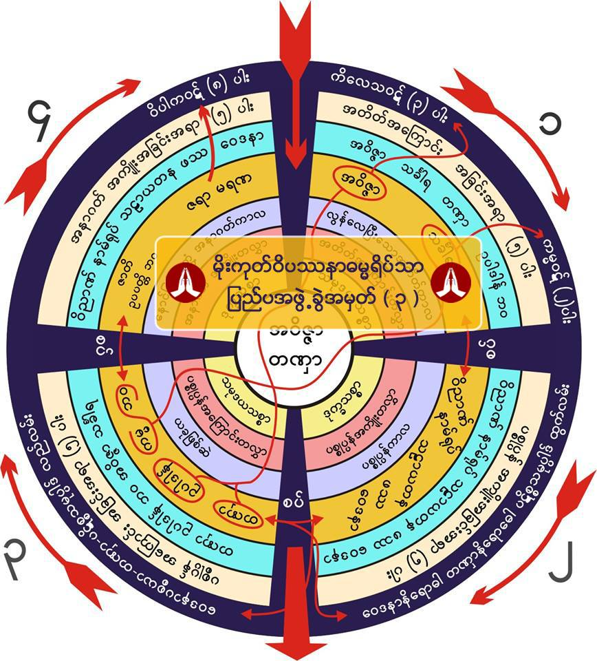
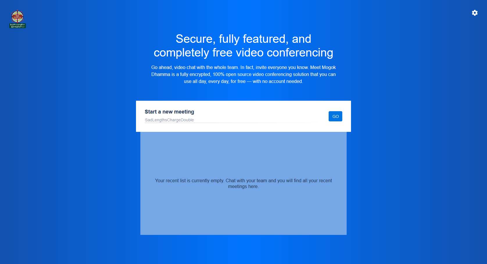

import SEO from "../../components/seo"
import { OutboundLink } from "gatsby-plugin-google-analytics"
import { Link } from "gatsby"

<SEO
    title="Case Study - Thuwanna Thingi Mogok Yeiktha-London"
    description="Secure conferencing software solution installed on Virtual Private Server."
/>

# Thuwanna Thingi Mogok Yeiktha-London #

## Secure conferencing software solution deployed on a VPS. ##

**Client: London based charity (<OutboundLink href="https://www.facebook.com/thuwannamogok" target="_blank" rel="noopener noreferrer">Thuwanna Thingi Mogok Yeiktha-London's Facebook Page</OutboundLink>)**

Having a common acquaintance with the charity, **Hatton Enterprise Solutions** has decided
to reach out and get feedback about the current conferencing solution in use. We learned
that the customer was using **Zoom** and that it had a few shortcomings:

- **40 minutes time limit** on free plan
- no native way to **live stream the meeting on YouTube**

The charity is already taking advantage of Facebook live streaming but they would like
to expand their reach and provide their followers the opportunity to also watch the
live streams on YouTube.

Our consultants have carefully evaluated the requirements and put together a secure, flexible
solution, to meet the needs. We recommended **an open-source conference software**, deployed
on **VPS (virtual private server)** under the **full control of the client**.

**Hatton Enterprise Solutions** has installed and configured **<OutboundLink href="https://jitsi.org/jitsi-videobridge/" target="_blank" rel="noopener noreferrer">Jitsi Videobridge</OutboundLink>**
on a VPS provided via our **<OutboundLink href="https://portal.hattonenterprisesolutions.uk" target="_blank" rel="noopener noreferrer">Web Hosting Portal</OutboundLink>**.
The client has configured the DNS records for their `.co.uk` domain (which they already owned) and **Hatton Enterprise Solutions**
has assisted in providing **free of charge SSL certificates via Let's Encrypt** to **secure the network traffic**.

*Below is the landing page for their very own video conferencing bridge:*

Could you perhaps benefit from using such a solution? Drop us a message and one of our consultants will be in touch with you.

<Link to="contact-us" className="button">Contact Us</Link>
