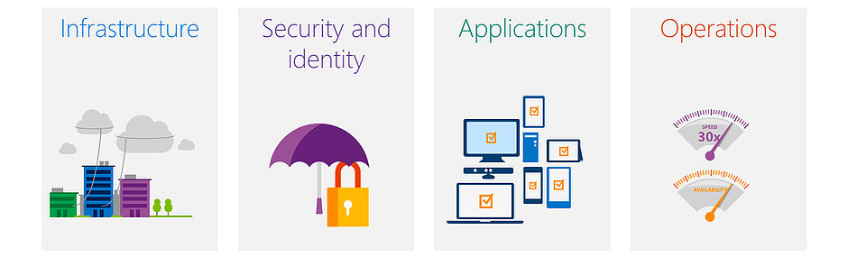
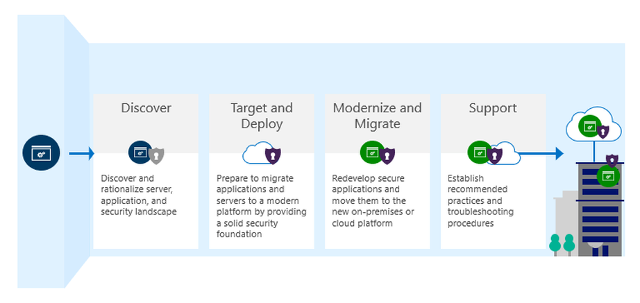

---

---
import AniLink from "gatsby-plugin-transition-link/AniLink"
import { Styled } from "theme-ui"
import SEO from "../components/seo"

<SEO title="Services"/>

# Services

Our Enterprise Cloud Services provides a variety of innovative and comprehensive IT Cloud solutions.
We deliver quality services in the most efficient way, and our experts will work collaboratively with you to
customize our offerings to your particular needs.​

<!-- ## Table Of Contents  ## -->

## We Cover

Click on one of the links below for more details:

* <Styled.a as={AniLink} paintDrip to="/services/consulting">Cloud Consulting Services</Styled.a>
* <Styled.a as={AniLink} paintDrip to="/services/solutions">Cloud Solutions</Styled.a>
* <Styled.a as={AniLink} paintDrip to="/services/migrations">Cloud Migrations</Styled.a>
* <Styled.a as={AniLink} paintDrip to="/services/devops">DevOps</Styled.a>
* <Styled.a as={AniLink} paintDrip to="/services/security-audit">Cyber Security Audit</Styled.a>
* <Styled.a as={AniLink} paintDrip to="/services/prisma-cloud">Prisma Cloud</Styled.a>

## Engagement Model

## Benefits of Hatton

### Reduce operational expenses

* Minimize your infrastructure, footprint through consolidation.

### Gain efficiencies

* Reduce application redundancies and minimize serve management.

### Streamline business processes

* Integrate heterogeneous infrastructure.

   