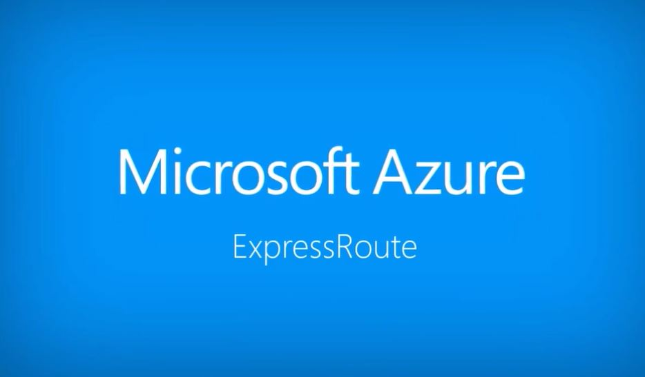

import SEO from "../../components/seo"

<SEO title="AWS / Azure Migrations"/>

# AWS / Azure Migrations #

## 60% of workloads will be running in the cloud by the end of 2020. Are you ready? ##

AWS and Azure are cloud services platform, that provide services in different domains such as compute, storage,
delivery and other functionality which help the business to scale and grow.

Our group of experts can asses what will be the  best  cloud provider for your business use cases,
and how to make an intelligent, tactical investment in the cloud to meet your specific outcomes.

  

## Azure ExpressRoute to Office 365 ##

Azure ExpressRoute is used with Office 365. We can plan the network implementation project that will
be required if you are deploying Azure ExpressRoute for use with Office 365.

Infrastructure and platform services running in Azure will often benefit by addressing network architecture and
performance considerations. We recommend ExpressRoute for Azure in these cases.

Software as a Service offerings like Office 365 and Dynamics 365 have been built to be accessed securely
and reliably via the Internet.

  

## Also ##

- Determine workload requirements & TCO
- Server workload migrations (database, web, application)
- Highly scalable, high-availability compute environment
- IaaS (Lift & Shift) / PaaS

  
