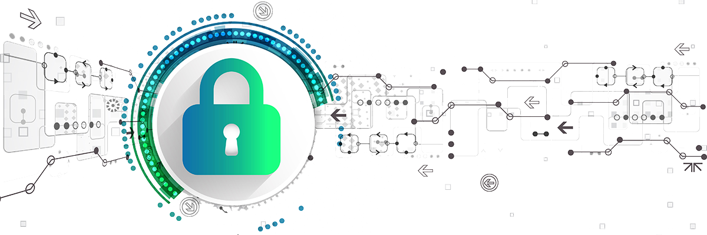

import SEO from "../../components/seo"

<SEO title="Cyber Security Audit"/>

# Cyber Security Audit #

The threat from cyber attacks is significant and always changing. Many audit committees and boards have set an expectation for internal audit
to understand and assess the organization’s capabilities in managing the associated risks. Using our experience in the field is an effective first step,
instructing an internal audit to be carried is the first step to conduct a cyber risk assessment.

  

Placing the findings into a concise summary for the audit will drive a risk-based, multi year cybersecurity plan.
Our consultants will be happy help conduct cyber security audits in line with industry standard compliance regulations.

  
